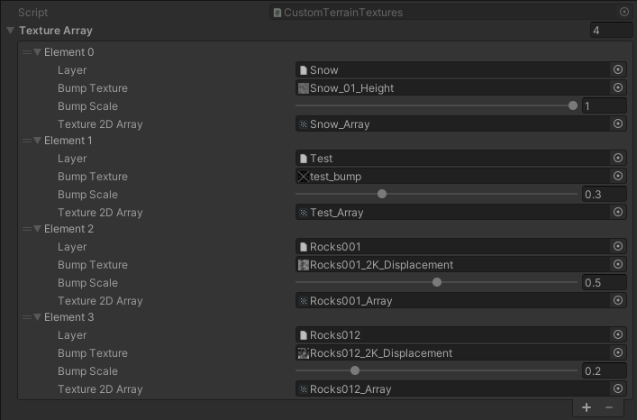
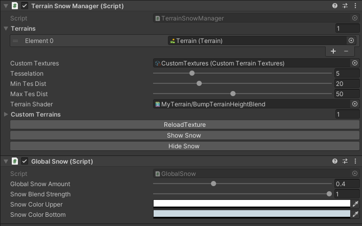

# Unity3D-Terrain-BumpSnowShader #
Custom Terrain bump snow shader with tessellation and 4+ textures for Unity3D.

## BUMP TERRAIN SHADER FOR TERRAIN 4+ TEXTURES ##
Using DirectX 11 instructions such as "DECLARE_TEX2DARRAY" you can use up to 12 textures (12 * 4 = 64 - albedo, normal, mask, bump) for Unity terrain.  
You can even try 16 textures, by editing shader by yourself.

## LEAVE SNOW STEPS ON TERRAIN! ##
Snow steps are rendered with second render camera and trailrenderer attached to gameobject.  

|  |  |
|------------------------------------|--------------------------------------|

## SUPPORT ##  
Shader for Legacy pipeline, DirectX 11+.  
No support for HDRP and LWRP etc.  
Could be intergrated with Vegetation Studio PRO TouchReact camera for snow steps.  
